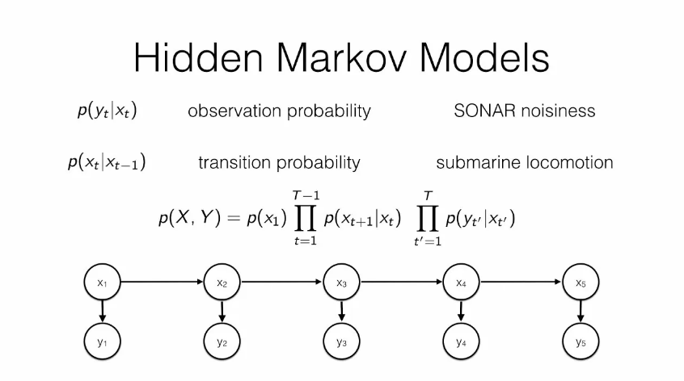
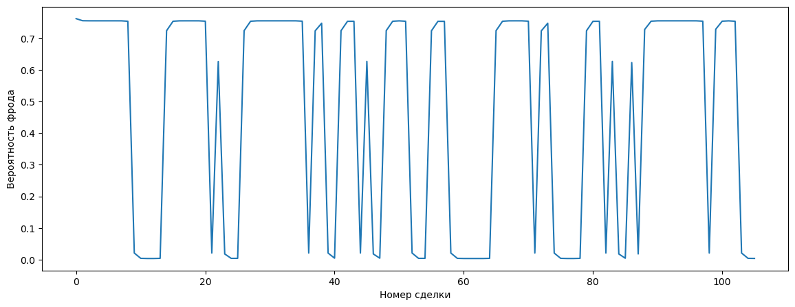

### Насколько крут портфель конгрессменов США?
>*Вдохновился [этой](https://www.reuters.com/legal/ex-us-congressman-sentenced-22-months-insider-trading-2023-09-19/) статьей*

 

### Новая постановка

Я решил двинуться немного в другую сторону и решить другую задачу: **какие сделки Ненси Пелоси проходят под инсайндерской торговлей?**. Чтобы попытаться ответить на этот вопрос я решил воспользоваться моделью скрытых марковских цепей. 

### Скрытая марковская цепь

Все просто:
1. Есть **скрытые состояния**, которые являются случайными велечинами
2. Есть **наблюдаемые состояния**, которые являются выходом скрытых состояний
3. Есть **матрица переходов** между скрытыми состояниями

В нашем случае:
1. Скрытые состояния - это сделка с инсайдерской информацией или без.
2. Наблюдаемые состояния - любой признак сделки, которую совершает Пелоси. Я решил, что лучше всего взять факт того, что сделка совершена с опционами, а не с акциями (по большей части у Пелоси только такие типы сделок: опционы и акции), поскольку опционы - более рисковая бумага, поэтому у Пелоси должны быть причины, чтобы внего вкладываться.

### Алгоритмы

Я воспользовался двумя алгоритмами:
1. **Алгоритм Баума-Велша**, чтобы вычислить параметры скрытой марковской цепи
2. **Постериорное декодирование**, 

### Результат

Здесь:
- по оси OY вероятность сделки быть инсайдерской
- по оси OX порядковый номер сделки

*Никита Соболев*
